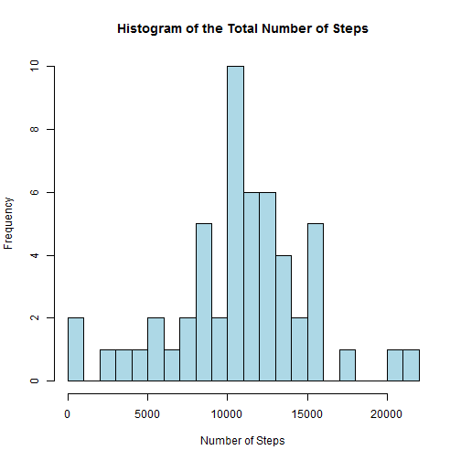
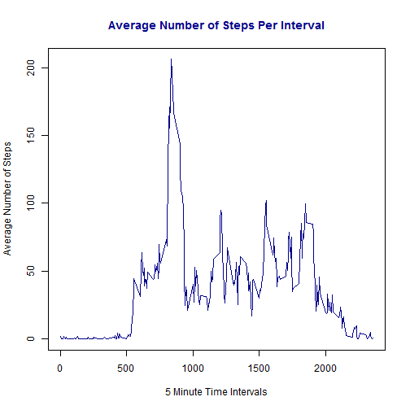
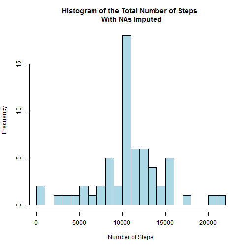
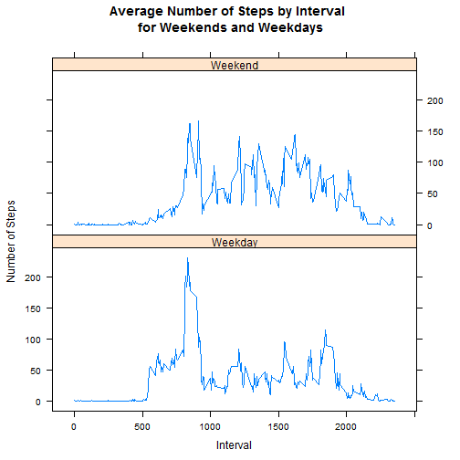

Reproducible Research: Peer Assessment 1
========================================================

## Loading and preprocessing the data

The first part of this project was to load the data and process/transform the data if necessary. 

Per the project specifications, below is the code needed to:
 1. Load the data
 2. Process/transform the data

Since the data provided was in csv format, I used the *read.csv* function to load the data.

The initial transformation I performed on the data was to convert the date from a factor class to a date class. First, I needed to convert the date from a factor class to a character class. Second, I used the *lubridate* package to convert the date to a date class.


```r
#Set working directory and load the data file
setwd("~/GitHub/RepData_PeerAssessment1/activity")
activity<-read.csv("activity.csv")

#check the structure of the data
str(activity)
```

```
## 'data.frame':	17568 obs. of  3 variables:
##  $ steps   : int  NA NA NA NA NA NA NA NA NA NA ...
##  $ date    : Factor w/ 61 levels "2012-10-01","2012-10-02",..: 1 1 1 1 1 1 1 1 1 1 ...
##  $ interval: int  0 5 10 15 20 25 30 35 40 45 ...
```

```r
class(activity$date)
```

```
## [1] "factor"
```

```r
#Transform the date 
library(lubridate)
activity$date<-as.character(activity$date)
class(activity$date)
```

```
## [1] "character"
```

```r
activity$date<-ymd(activity$date)
class(activity$date)
```

```
## [1] "POSIXct" "POSIXt"
```


## What is mean total number of steps taken per day?

In order to answer this question, we were asked to ignore the missing values and:
 1. Make a histogram of the total number of steps taken each day
 2. Calculate and report the mean and median total number of steps taken per day

To find the mean total number of steps taken per day, I used the *summaryBy* function in the *doBy* package to calculate the sum, mean and median number of steps for each date. As you can tell from the output below:

 - The mean number of steps was 10766
 - The median for the number of steps was 10765

Following the code below, you will find a histogram of the total number of steps taken each day


```r
#Calculate sum steps per day
library(doBy)
```

```
## Loading required package: survival
## Loading required package: splines
## Loading required package: MASS
```

```r
stepsbydate<-summaryBy(steps~date, data=activity,FUN=c(sum,mean,median))


#Histogram of Total Number of Steps per day ignoring NAs
hist(stepsbydate$steps.sum,25,col="light blue", main="Histogram of the Total Number of Steps",
     xlab="Number of Steps")
```

 

```r
#Calculate and report the mean and median number of steps per day
activity.mean<-mean(stepsbydate$steps.sum,na.rm=T)
activity.mean
```

```
## [1] 10766
```

```r
activity.median<-median(stepsbydate$steps.sum,na.rm=T)
activity.median
```

```
## [1] 10765
```


## What is the average daily activity pattern?

In order to find the answer to this question, we were asked to:
 1. Make a time series plot of the 5-minute interval (x-axis) and the average number of steps taken, averaged across all days (y-axis)
 2. Which 5-minute interval, on average across all days in the dataset, contains the maximum number of steps?

As you can see from the output below, the interval with the maximum number of steps is interval 835.

Following the code below, you will find the time series plot of the average number of steps per interval.


```r
#Calculate the total steps, mean number of steps, and median number of steps 
#by interval 
stepsbyinterval<-summaryBy(steps~interval, data=activity, na.rm=T,FUN=c(sum, mean, median))
str(stepsbyinterval)
```

```
## 'data.frame':	288 obs. of  4 variables:
##  $ interval    : int  0 5 10 15 20 25 30 35 40 45 ...
##  $ steps.sum   : num  91 18 7 8 4 111 28 46 0 78 ...
##  $ steps.mean  : num  1.717 0.3396 0.1321 0.1509 0.0755 ...
##  $ steps.median: num  0 0 0 0 0 0 0 0 0 0 ...
```

```r
#Make a Time Series Plot of average number of steps for all days
library (zoo)
```

```
## 
## Attaching package: 'zoo'
## 
## The following objects are masked from 'package:base':
## 
##     as.Date, as.Date.numeric
```

```r
ts_stepsbyinterval<-zoo(stepsbyinterval$steps.mean, stepsbyinterval$interval)

xlab="5 Minute Time Intervals"
ylab="Average Number of Steps"
main="Average Number of Steps Per Interval" 

plot(ts_stepsbyinterval, lty="solid",col="dark blue", xlab=xlab,ylab=ylab, main=main,col.main="dark blue")
```

 

```r
#Find the interval with the highest mean number of steps
max_steps.mean<-which.max(stepsbyinterval$steps.mean)
stepsbyinterval[max_steps.mean,]
```

```
##     interval steps.sum steps.mean steps.median
## 104      835     10927      206.2           19
```


## Imputing missing values
Next, we were asked to:
 1. Calculate and report the total number of missing values in the dataset
 2. Devise a strategy for filling in all of the missing values in the dataset.
 3. Create a new dataset that is equal to the original dataset but with the missing data filled in
 4. Make a histogram of the total number of steps taken each day and calculate and report the mean and median total number of steps taken per day

We also had to answer the question *Do these values differ from the estimates from the first part of the assignment? What is the impact of imputing missing data on the estimates of the total daily number of steps?*

First, as you can see from the output below, the total number of missing values (NA's) were 2304.


```r
#Report the total number of NAs
activitynew<-merge(activity, stepsbyinterval)
summary(activitynew$steps)
```

```
##    Min. 1st Qu.  Median    Mean 3rd Qu.    Max.    NA's 
##     0.0     0.0     0.0    37.4    12.0   806.0    2304
```

The strategy I used for filling in the missing values was to use the mean number of steps for each interval. Below is the code I used to do this.


```r
#Impute NAs

activitynew$steps <- ifelse(!is.na(activitynew$steps),
                            activitynew$steps,
                            (activitynew$steps.mean))
```

Next, in order to create a new dataset with the missing values filled in, I used the code found below.


```r
#Create a dataset like original dataset but with imputed NAs


activitynewag<-aggregate(steps~date, data=activitynew, sum)

imputed.stepsbyinterval<-summaryBy(steps~interval, data=activitynew,FUN=c(sum, mean, median))

imputed.activity<-subset(activitynew, 
                         select=c("steps","date","interval"))
#Compare original dataset with new imputed dataset
str(activity)
```

```
## 'data.frame':	17568 obs. of  3 variables:
##  $ steps   : int  NA NA NA NA NA NA NA NA NA NA ...
##  $ date    : POSIXct, format: "2012-10-01" "2012-10-01" ...
##  $ interval: int  0 5 10 15 20 25 30 35 40 45 ...
```

```r
str(imputed.activity)
```

```
## 'data.frame':	17568 obs. of  3 variables:
##  $ steps   : num  1.72 0 0 0 0 ...
##  $ date    : POSIXct, format: "2012-10-01" "2012-11-23" ...
##  $ interval: int  0 0 0 0 0 0 0 0 0 0 ...
```

Below you will find the histogram of the total number of steps taken each day for the new data that has the missing values filled in. You will also find the calculated mean number of steps and the median for the total number of steps. The mean is 10766 and the median is 10766.


```r
#Histogram of total number of steps but with NAs that have been imputed
hist(activitynewag$steps,25,col="light blue",main=
             "Histogram of the Total Number of Steps \n With NAs Imputed",xlab=
             "Number of Steps")
```

 

```r
#Report the Mean and median total number of steps but with NAs imputed
activitynewag.mean<-mean(activitynewag$steps)
activitynewag.mean
```

```
## [1] 10766
```

```r
activitynewag.median<-median(activitynewag$steps)
activitynewag.median
```

```
## [1] 10766
```

```r
#Compare to the Mean and median total number of steps for original dataset
activity.mean<-mean(stepsbydate$steps.sum,na.rm=T)
activity.mean
```

```
## [1] 10766
```

```r
activity.median<-median(stepsbydate$steps.sum,na.rm=T)
activity.median
```

```
## [1] 10765
```
As you can see from the information above, the new values for the mean and median do not vary from the old values; however, by comparing the *Histogram of the Total Number of Steps* with the *Histogram of the Total Number of Steps With NAs Imputed*, you can see that there was an increase in the total number of steps after imputing the missing values.

## Are there differences in activity patterns between weekdays and weekends?

Using the dataset with the missing values filled in, we had to complete the following tasks:
 1. Create a new factor variable in the dataset with two levels: *Weekday* and *Weekend*.
 2. Make a panel plot containing a time series plot of the 5-minute interval and the average number of steps taken, averaged across all weekday days or weekend days.

Below you will find the code and output required.


```r
#Create a new factor variable with "weekday" and "weekend"

day.of.week<-weekdays(imputed.activity$date)
imputed.activity.weekdays<-cbind(imputed.activity, day.of.week)

weekday.weekend<-ifelse(imputed.activity.weekdays$day.of.week %in%c("Saturday","Sunday"), 
                        "Weekend","Weekday")
imputed.activity.weekdays<-cbind(imputed.activity.weekdays, weekday.weekend)
str(imputed.activity.weekdays)
```

```
## 'data.frame':	17568 obs. of  5 variables:
##  $ steps          : num  1.72 0 0 0 0 ...
##  $ date           : POSIXct, format: "2012-10-01" "2012-11-23" ...
##  $ interval       : int  0 0 0 0 0 0 0 0 0 0 ...
##  $ day.of.week    : Factor w/ 7 levels "Friday","Monday",..: 2 1 4 6 3 5 3 1 7 4 ...
##  $ weekday.weekend: Factor w/ 2 levels "Weekday","Weekend": 1 1 2 1 2 1 2 1 1 2 ...
```

```r
#Make panel plot of time series of interval and average steps by weekday or weekend
ts.weekdays<-summaryBy(steps~interval+weekday.weekend, data=imputed.activity.weekdays,FUN=c(mean))


library(lattice)
xyplot(steps.mean~interval|weekday.weekend, ts.weekdays,
       type=c("l","l"),layout=c(1,2),main="Average Number of Steps by Interval \n for Weekends and Weekdays",
       xlab="Interval", ylab="Number of Steps")
```

 

As you can see from the graph above, the data show that during weekdays, there is an increase in the number of steps during the early parts of the day, with a smaller number of steps during the later parts of the day. On the other hand, the data show that the number of steps during the weekend stays constant during the days. Therefore, the data show that there is a difference in the activity pattern between weekend days and weekdays.

*Sources:Assignment guidelines from the Reproducible Research class.*
